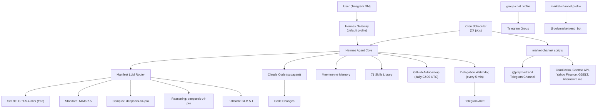

# System Architecture Overview

The complete picture of how all components connect — profiles, gateways, cron jobs, subagents, and delivery platforms.

## How a Message is Processed

1. **User sends message** via Telegram DM
2. **Gateway receives it** and routes to the default profile
3. **Manifest Router** selects the appropriate model tier based on complexity
4. **Hermes plans** the approach and delegates subtasks to Claude Code or script-based workers
5. **Subagents execute** and return results
6. **Hermes synthesizes**, formats, and replies via Telegram

## How a Cron Job Runs

1. **Cron scheduler fires** the job at the defined UTC time
2. **Python script fetches** raw data from public APIs (`no_agent=true`, no LLM involved)
3. **`llm_enricher.py` formats** and enriches the raw output with AI
4. **Shell wrapper delivers** the enriched output to the Telegram channel
5. **State file is updated** to prevent duplicate posts

## Profile Isolation at a Glance

| Profile | Gateway Service | Model | Memory | Toolsets | Delivery |
|---|---|---|---|---|---|
| default | hermes-gateway | deepseek-v4-pro | Mnemosyne ON | All (full access) | @hermespikachu_bot |
| group-chat | hermes-gateway-group-chat | deepseek-v4-flash | Mnemosyne OFF | 26 disabled (chat-only) | @PikachuGroupBot |
| market-channel | hermes-gateway-market-channel | N/A (script-only) | N/A | Cron + scripts only | @polymarkettrend_bot |

## Key Numbers

| Metric | Value |
|---|---|
| Cron Jobs | 27 |
| Skills Installed | 71 |
| LLM Router Tiers | 5 |
| Active Profiles | 3 |
| Market Data Pipelines | 13 |
| Subagent Max Concurrent | 3 |
| Watchdog Check Interval | Every 5 minutes |
| GitHub Backup Retention | 14 snapshots |
| marketbot.py Size | 827 lines |
